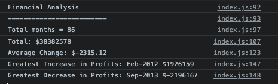

# Console-Finances

## My Task

My task was to write JavaScript code that analyzes the records to calculate each of the following:

* The total number of months included in the dataset.

* The net total amount of Profit/Losses over the entire period.

* The average of the changes in Profit/Losses over the entire period.

* You will need to track what the total change in profits is from month to month and then find the average.

  (Total/Number of months)

* The greatest increase in profits (date and amount) over the entire period.

* The greatest decrease in losses (date and amount) over the entire period.

My aim was to ensure that each result was printed to the console.

## Image of Financial Analysis Console

## Link to Deployed Website

https://rbcheung.github.io/Console-Finances/ 
 